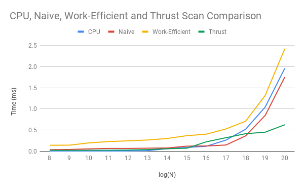
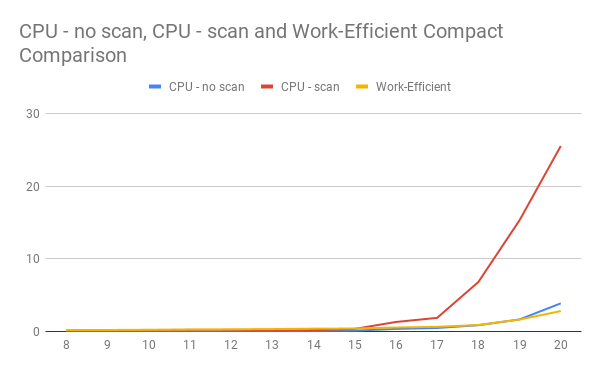

CUDA Stream Compaction
======================

**University of Pennsylvania, CIS 565: GPU Programming and Architecture, Project 2**

* Zach Corse
  * LinkedIn: https://www.linkedin.com/in/wzcorse/
  * Personal Website: https://wzcorse.com
  * Twitter: @ZachCorse
* Tested on: Windows 10, i7-6700HQ @ 2.60GHz 32GB, NVIDIA GeForce GTX 970M (personal computer)

## README

Introduction
------------

In this project I take a stab at implementing a scan algorithm on the GPU and compare the performance with a straightforward implementation on the CPU. For those not familiar with scan, this algorithm accepts an array idata of numbers then returns an array odata such that each element in odata is the sum of all elements in idata that precede the index in consideration (specifically, this is known as an exclusive scan, because the value stored at the index in consideration in idata is not included in the sum).

I also include a parallel implementation of the compact algorithm, which uses scan as part of its implementation. This algorithm accepts an array of data, converts this array into an array of booleans according to a predefined rule (in this case, is the value zero or not), then "removes" the values that are false, thereby compacting the original array into one which preserves the array's remaining useful information.

As shown here, my implementations pass the tests designed to check accuracy and measure timing for each algorithm. Speed comparisons are discussed in detail below.

```
****************
** SCAN TESTS **
****************
    [  43   1  21   0  10  41  43   1  21  16  31  44  19 ...   6   0 ]
==== cpu scan, power-of-two ====
   elapsed time: 0.00079ms    (std::chrono Measured)
    [   0  43  44  65  65  75 116 159 160 181 197 228 272 ... 6155 6161 ]
==== cpu scan, non-power-of-two ====
   elapsed time: 0.000395ms    (std::chrono Measured)
    [   0  43  44  65  65  75 116 159 160 181 197 228 272 ... 6077 6104 ]
    passed
==== naive scan, power-of-two ====
   elapsed time: 0.04864ms    (CUDA Measured)
    passed
==== naive scan, non-power-of-two ====
   elapsed time: 0.047904ms    (CUDA Measured)
    passed
==== work-efficient scan, power-of-two ====
   elapsed time: 0.20016ms    (CUDA Measured)
    passed
==== work-efficient scan, non-power-of-two ====
   elapsed time: 0.183488ms    (CUDA Measured)
    passed
==== thrust scan, power-of-two ====
   elapsed time: 0.022336ms    (CUDA Measured)
    passed
==== thrust scan, non-power-of-two ====
   elapsed time: 0.02464ms    (CUDA Measured)
    passed

*****************************
** STREAM COMPACTION TESTS **
*****************************
    [   3   1   3   0   2   3   1   3   3   0   1   2   3 ...   2   0 ]
==== cpu compact without scan, power-of-two ====
   elapsed time: 0.001185ms    (std::chrono Measured)
    [   3   1   3   2   3   1   3   3   1   2   3   1   1 ...   2   2 ]
    passed
==== cpu compact without scan, non-power-of-two ====
   elapsed time: 0.001185ms    (std::chrono Measured)
    [   3   1   3   2   3   1   3   3   1   2   3   1   1 ...   1   3 ]
    passed
==== cpu compact with scan ====
   elapsed time: 0.00158ms    (std::chrono Measured)
    [   3   1   3   2   3   1   3   3   1   2   3   1   1 ...   2   2 ]
    passed
==== work-efficient compact, power-of-two ====
   elapsed time: 0.237024ms    (CUDA Measured)
    passed
==== work-efficient compact, non-power-of-two ====
   elapsed time: 0.276832ms    (CUDA Measured)
    passed
```

Scan Performance Analysis
------------

Here I compare four different implementations of the scan algorithm. The first is on the CPU, and is straightforward:

```
void scan(int n, int *odata, const int *idata) {
timer().startCpuTimer();
odata[0] = 0;
for (int k = 1; k < n; ++k) {
    odata[k] = idata[k - 1] + odata[k - 1];
    }
timer().endCpuTimer();
}

```

On the GPU, I compare three scan implemenations. The first is "naive." In parallel, it loops over an array log(n) times, keeping track of an offset for each loop that scales as 2^(d-1) where d is the loop index. The "work-efficient" scan uses an algorithm developed in 1978 that first applies an "upsweep" to the array (which is equivalent to parallel reduction) then follows with a downsweep, which cleverly computes the scanned array. In theory, this should be faster than the naive implementation. Finally, I call the thrust library's scan algorithm as a gold standard to which I can compare my implementation.



The results are counterintuitive but informative. The CPU implementation is actually faster for sufficiently small arrays. Thrust outperforms the CPU for sufficiently large arrays, however. My naive implementation is slightly less efficient than thrust, but scales similarly. My supposedly "work efficient" implementation, however is much less efficient than all three. I can attribute this to several factors: first and foremost, my implemenation does not use blocking and shared memory. Instead, each thread must access and write values stored in global memory, which is far slower than reading and writing to shared memory per block. Additionally, for each loop d in upsweep and downsweep, I launch a thread for each index in the array. This is highly inefficient, as the greater d is, the fewer the indices that actually affect up/downsweep, which both sum and modify indices in intervals of 2^(d+1) (a binary tree structure). These indices are also distributed across multiple blocks, further indicating that executing scan recursively per block would lead to a significant speedup.

Compact Performance Analysis
------------

As shown below, my CPU compact implementation outpeforms my parallel compact implementation which relies on my "work-efficient" scan implementation (and is therefore consistently slower). My CPU implementation that uses my CPU scan implementation rather than a more straightforward naive approach (CPU - no scan) is in fact slower, which is most likely due to the fact that scan requires that I generate two additional heap-based arrays to manage intermediate boolean and scanned boolean arrays.


